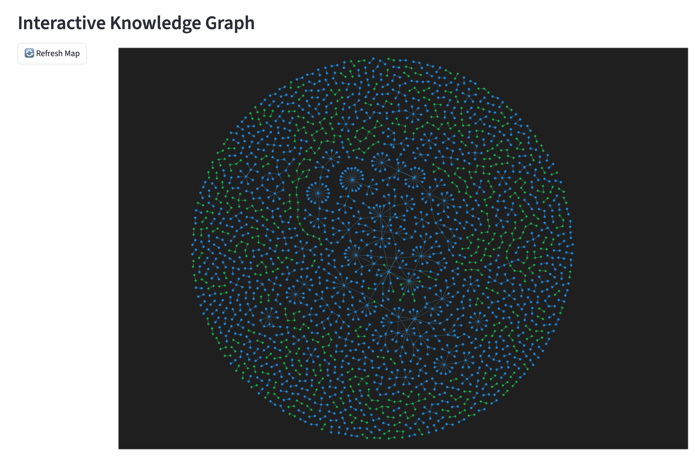

# 🧠 SiliconBrain: The 20-Watt General-Purpose Expert



## 🚧 Project Status: Proof of Concept
SiliconBrain is a **functional research prototype** of a general-purpose Neuro-Symbolic AI system. While it ships with a massive pre-loaded library for software engineering, the underlying architecture is designed to **master any technical or creative domain** autonomously.

SiliconBrain is a high-performance **Neuro-Symbolic Framework** designed to run on local hardware with the efficiency of a human brain (~20 Watts). By separating **Declarative Knowledge** (Facts in a Graph Database) from **Procedural Logic** (State Machines), SiliconBrain enables tiny local models to achieve the reasoning capabilities of trillion-parameter giants.

## 🚀 Key Features

- **Domain-Agnostic Mastery:** Use the Mastery Engine to "download" expert-level knowledge in any field (Medicine, Law, Engineering, etc.) into a local graph.
- **Sparse Activation:** Saves up to **90% in tokens** by only retrieving relevant graph nodes instead of massive raw text contexts.
- **Autonomous Learning:** Features a **Curiosity Engine** that identifies gaps in its own knowledge and bridges them automatically.
- **20-Watt Local Mode:** Designed to run the primary chat orchestration on your local CPU (via Ollama) while using high-IQ models (via DeepSeek) for background learning.
- **Visual Reasoning:** Interactive **Knowledge Map Viewer** (via PyVis) lets you explore the brain's evolving memory in your browser.

## 📦 Pre-Loaded: Software Engineering Knowledge Pack
As a demonstration of its power, this repository includes a pre-trained memory of **15,000+ nodes** covering the deep-lore and architectural patterns of:
- **Python:** Internals, DDD, Performance, and Meta-programming.
- **Rust:** Ownership, Fearless Concurrency, and Async internals.
- **TypeScript:** Advanced Type System, Compiler API, and Full-stack patterns.

## 🛠️ Tech Stack

- **Memory:** Memgraph (Graph Database)
- **Logic:** LangGraph (State Machines)
- **Interface:** Streamlit (Web Dashboard)
- **Compute:** Ollama (Local) & DeepSeek API (Teacher)
- **Orchestration:** Python (LangChain)

## 🚦 Quick Start

### 1. Prerequisites
- [Docker Desktop](https://www.docker.com/products/docker-desktop/)
- [Ollama](https://ollama.com/) (Download `llama3.2:3b`)

### 2. Setup
```bash
# Clone the repository
git clone https://github.com/your-username/SiliconBrain.git
cd SiliconBrain

# Create virtual environment
python3 -m venv venv
source venv/bin/activate

# Install dependencies
pip install -r requirements.txt

# Configure environment
cp .env.example .env
# Edit .env and add your DeepSeek API Key
```

### 3. Launch
```bash
# Start the Knowledge Graph
docker-compose up -d

# Start the Dashboard
streamlit run dashboard.py
```

## 🧠 Using the Pre-Trained Brain
SiliconBrain comes with a pre-trained memory of **15,000+ nodes** covering Python, Rust, and TypeScript. To inject this memory into your local instance:
1. Ensure Memgraph is running: `docker-compose up -d`
2. Run the injection command:
```bash
cat data/trained_brain.cypher | docker exec -i memgraph mgconsole --output_format=cypherl
```

## 🛠️ Troubleshooting
- **Docker Connection:** If you see a `Connection Refused` error, ensure Docker Desktop is running and run `docker-compose up -d` to start the Memgraph container.
- **Ollama API:** Ensure `ollama serve` is active. SiliconBrain looks for Ollama on the default port `11434`.
- **API Keys:** Make sure your DeepSeek key is correctly placed in the `.env` file for the "Teacher" to function.

## 🗺️ System Architecture

1.  **The Librarian (`layers/extractor.py`):** Converts raw text/explanations into structured Triplets.
2.  **The Brain Memory:** Stores thousands of technical interconnections in Memgraph.
3.  **The Orchestrator (`layers/orchestration_v2.py`):** A LangGraph agent that performs sparse retrieval to answer queries.
4.  **The Mastery Engine:** Recursively interrogates a "Teacher" LLM to map out entire programming domains.

## 🔋 The Efficiency Proof
SiliconBrain includes a live **Efficiency Report** that compares Scenario A (Standard LLM Full-Context) vs Scenario B (SiliconBrain Sparse Graph). Most technical queries show a **10x reduction in compute requirements**.

---
*Created with the vision of efficient, grounded, and local-first intelligence.*
**10x reduction in compute requirements**.

---
*Created with the vision of efficient, grounded, and local-first intelligence.*
