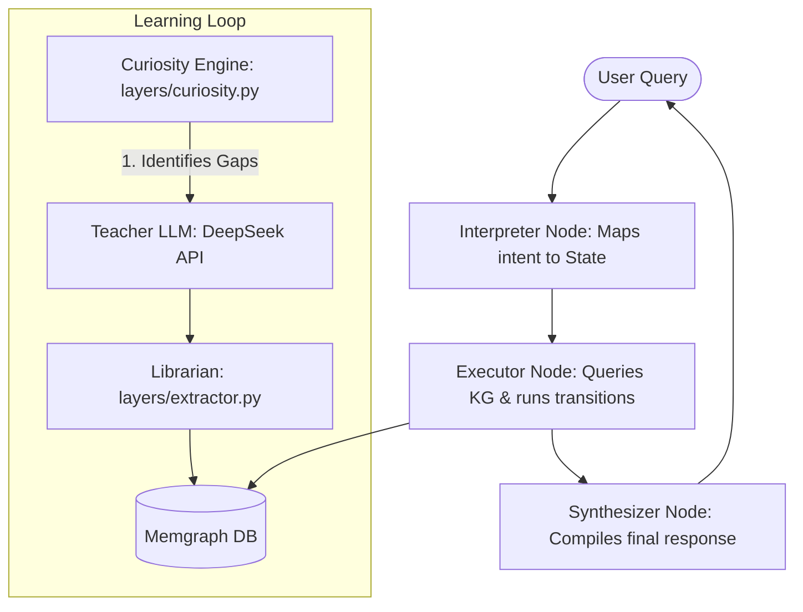

# 🧠 SiliconBrain: Local Graph-Backed Reasoning for Small Models

[](LICENSE)
[](https://www.python.org/)
[](https://github.com/langchain-ai/langgraph)
[](https://memgraph.com/)
[](https://ollama.com/)

SiliconBrain is a local-first **neuro-symbolic prototype** that separates **declarative knowledge** (facts in a graph database) from **procedural logic** (state-machine workflows). The goal is to help smaller local models answer technical questions with less prompt bloat by retrieving a compact, structured slice of external memory instead of relying entirely on large in-context payloads.


## 💡 Quick Walkthrough: From Learning to Generation

Here is a typical end-to-end flow of how SiliconBrain operates:

1. **Train the Brain (Mastery):** You ask the **Mastery Engine** to learn many Python topics (e.g., *"Python Memory Management and PyObject header"*). The system interrogates a high-IQ Teacher LLM, extracts declarative facts (triples) and procedural workflow steps, and writes them to the local **Memgraph** database. **After adequate training, the brain will have accumulated a rich Python knowledge base.**
2. **Generate Python Scripts:** When you ask the agent, *"Write a script that accesses a PyObject header to inspect refcounts,"* the orchestrator intercepts the query.
3. **Reduce Prompt Context:** Instead of sending a broad context payload to the LLM, SiliconBrain performs **sparse graph activation**. It retrieves only the specific nodes and relationships related to your request from the graph, which can significantly reduce token usage on some technical tasks.

---

## 🚧 Project Status: Proof of Concept

SiliconBrain is a **functional research prototype**. It ships with a pre-loaded software engineering knowledge pack and explores an architectural direction: externalize reusable knowledge and workflow structure so a local model can work with smaller, more task-specific prompts.

---

## 🚀 Key Features

*   **Structured External Memory:** Store reusable facts and workflow steps in a graph database instead of relying only on the model's latent knowledge.
*   **Sparse Activation:** Retrieve only relevant graph nodes for a task instead of feeding a much broader context payload to the LLM.
*   **Autonomous Curiosity Engine:** Features a background loop that identifies gaps in its own knowledge, ponders what it needs to learn next, and bridges those gaps automatically.
*   **Local Runtime + Teacher Distillation:** Run the primary chat orchestration locally via Ollama while optionally using a stronger teacher model such as DeepSeek for background knowledge distillation.
*   **Visual Reasoning:** Interactive **Knowledge Map Viewer** (via PyVis) lets you explore the brain's evolving memory and state transitions directly in your browser.

---

## 🗺️ System Architecture

SiliconBrain splits cognitive tasks into two distinct layers:
1.  **The "What" Layer (Declarative):** Structured triplets (`{subject, predicate, object}`) stored in **Memgraph**.
2.  **The "How" Layer (Procedural):** Structured state transitions (`{current_state, action, next_state}`) orchestrating workflows via **LangGraph**.



### Core Components:
*   **The Orchestrator ([layers/orchestration_v2.py](layers/orchestration_v2.py)):** A LangGraph agent that performs sparse graph retrieval to answer user queries with a smaller task-specific context.
*   **The Librarian ([layers/extractor.py](layers/extractor.py)):** Parses raw explanation texts and distills them into structured entity triplets and state-transition schemas.
*   **The Teacher Interface ([layers/teacher.py](layers/teacher.py)):** Queries a high-IQ LLM to explain complex domains.
*   **The Curiosity Engine ([layers/curiosity.py](layers/curiosity.py)):** Shuffles current database entities, ponders knowledge gaps, and schedules new topics for the Teacher to distill.

---

## 📦 Pre-Loaded: Software Engineering Knowledge Pack

This repository includes a pre-trained memory of **15,000+ nodes** covering the deep-lore and architectural patterns of:
*   **Python:** Internals, DDD, Performance, and Meta-programming.
*   **Rust:** Ownership, Fearless Concurrency, and Async internals.
*   **TypeScript:** Advanced Type System, Compiler API, and Full-stack patterns.

---

## 🔋 The Efficiency Proof

SiliconBrain includes a live **Efficiency Report** in the dashboard comparing:
*   **Scenario A:** Standard LLM (Full-Context RAG)
*   **Scenario B:** SiliconBrain (Sparse Graph Retrieval)

In local testing, Scenario B can substantially reduce prompt context by loading only the localized neighborhood of nodes relative to the user's intent. Treat the dashboard numbers as comparative in-app estimates, not a universal benchmark across all tasks.

---

## 🛠️ Quick Start

### 1. Prerequisites
*   [Docker Desktop](https://www.docker.com/products/docker-desktop/)
*   [Ollama](https://ollama.com/) (Ensure the daemon is running and you have the orchestrator model from `.env` available; `.env.example` uses `llama3.2:3b`)

### 2. Setup
```bash
# Clone the repository
git clone https://github.com/qdmudong/SiliconBrain.git
cd SiliconBrain

# Create virtual environment
python3 -m venv venv
source venv/bin/activate

# Install dependencies
pip install -r requirements.txt

# Configure environment
cp .env.example .env
# Edit .env and configure your API keys and model preferences
```

By default, `.env.example` uses:
- `ORCHESTRATOR_PROVIDER=ollama`
- `ORCHESTRATOR_MODEL=llama3.2:3b`
- `TEACHER_PROVIDER=deepseek`
- `TEACHER_MODEL=deepseek-chat`

### 3. Inject the Pre-Trained Brain
Ensure Memgraph is running, then run the injection command to load the 15,000+ node software engineering knowledge pack:
```bash
# Start the Knowledge Graph container
docker-compose up -d

# Inject cypher snapshot
cat data/trained_brain.cypher | docker exec -i memgraph mgconsole --output_format=cypherl
```

### 4. Launch the Dashboard
```bash
streamlit run dashboard.py
```
Open your browser to `http://localhost:8501` to chat with the brain, view the interactive visual map, or launch recursive mastery engines.

Note: launching the dashboard also starts a background ingestion watcher in the app process. Files uploaded to `data/ingest/` are polled and processed automatically.

---

## 🛠️ Troubleshooting

*   **Docker Connection:** If you encounter `Connection Refused` errors, make sure Docker Desktop is active and `docker ps` shows the `memgraph` container running on port `7687`.
*   **Ollama Connection:** Verify your Ollama instance is serving on the default port `11434` (SiliconBrain connects to Ollama via `http://localhost:11434/v1`).
*   **Teacher API Keys:** Ensure your DeepSeek API key is correctly configured in your `.env` file for the background learner to operate.

---
*Created with the vision of efficient, grounded, and local-first intelligence.*
